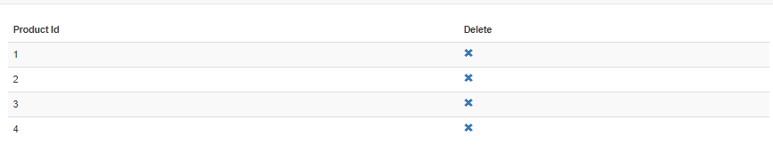
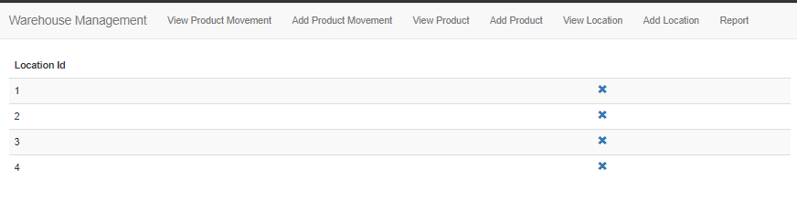
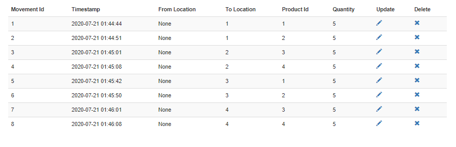
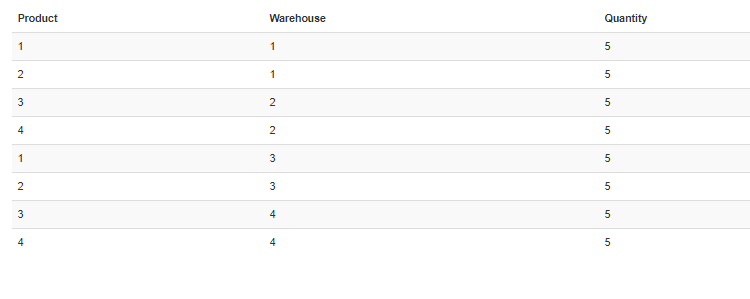
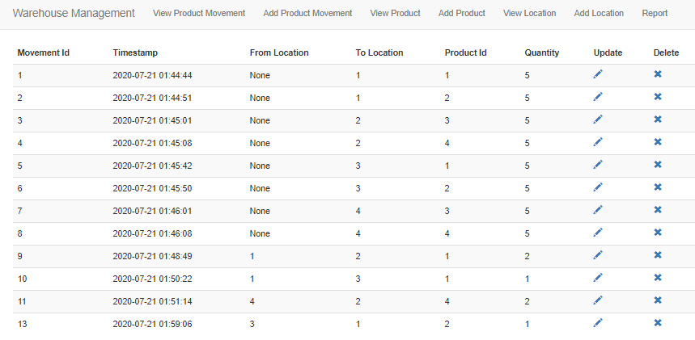
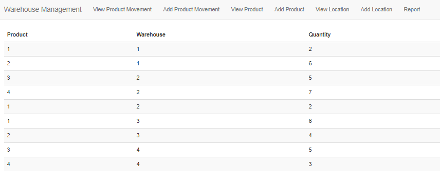
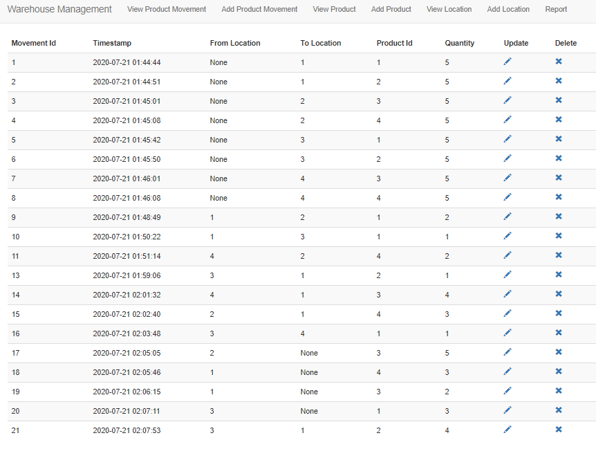
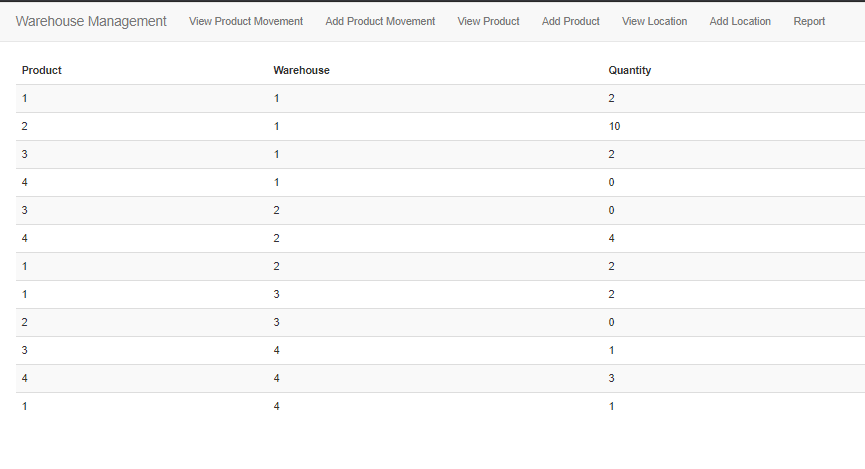

# **Warehouse Management**

_Mohammad Hasnain Rajan_

## **Following are the steps to run the application**

```git clone [https://github.com/hasnain2808/Warehouse-Management](https://github.com/hasnain2808/Warehouse-Management)
cd Warehouse-Management
python -m venv venv
#activate the venv depending on the OS
  Windows venv\Scripts\activate
  Ubuntu source venv\bin\activate
python -m pip install -r requirements.txt
set variables depending upon os
  Windows
    set FLASK\_APP=warehouse\_management
    set FLASK\_ENV=development
  Ubuntu
    export FLASK\_APP=warehouse\_management
    export FLASK\_ENV=development
#flask init-db Run this command only if you want a fresh sqlite instance
flask run
```

Go to [http://localhost:5000/](http://localhost:5000/) to use the App

## **This report summarizes the key features of the MVP**

**Database**

SQLite was used so that evaluation is easier

The requirements issued directed creation of the following Tables

1. Product (product\_id)
2. Location (location\_id)
3. ProductMovement (movement\_id, timestamp, from\_location, to\_location, product\_id, qty)

Script used

```DROP TABLE IF EXISTS Product;

DROP TABLE IF EXISTS Location;

DROP TABLE IF EXISTS ProductMovement;

CREATE TABLE Product (

  product\_id INTEGER PRIMARY KEY AUTOINCREMENT

  );

CREATE TABLE Location (

  location\_id INTEGER PRIMARY KEY AUTOINCREMENT

  );

CREATE TABLE ProductMovement (

  movement\_id INTEGER PRIMARY KEY AUTOINCREMENT,

  timestamp TIMESTAMP DEFAULT CURRENT\_TIMESTAMP NOT NULL,

  from\_location INTEGER ,

  to\_location INTEGER ,

  product\_id INTEGER NOT NULL,

  qty INTEGER,

  FOREIGN KEY (movement\_id) REFERENCES Product (product\_id),

  FOREIGN KEY (from\_location) REFERENCES Location (location\_id),

  FOREIGN KEY (to\_location) REFERENCES Location (location\_id)

);
```
**Views:**

The views were created as directed in the requirements. Edit for Location and Product is not created because as they have only one column and that is the primary key. Editing it is not correct. Although Delete is added for all Entities

| **Requirement** | **Endpoint** |
| --- | --- |
| Add Product | /product/add\_product |
| View Product | /product/view\_product |
| Delete Product | /product/delete\_product/id |
| Add Location | /location/add\_location |
| View Location | /location/view\_location |
| Delete Location | /location/delete\_location/id |
| Add ProductMovement | /product\_movement/add\_product\_movement |
| Edit ProductMovement | /product\_movement/update\_product\_movement/id |
| View ProductMovement | /product\_movement/view\_product\_movement |
| Delete ProductMovement | /product\_movement/delete\_product\_movement/1 |
| Report | /product\_movement/get\_report |

**Use Cases**

1. Create 3/4 Products



1. Create 3/4 Locations



1. Make ProductMovements
  1. After 8 Movements

View



Report



  1. After 12 movements

View



Report



  1. After 20 movements



Final Report



## **Key Features**

1. Responsive UI using Bootstrap
2. Add, view, Delete Location
3. Add, view, Delete Product
4. Add, view, Edit, Delete ProductMovements
5. Final Report handles all types of product movements. If the user moves out something that is not available that is easily recognizable in the report by a negative quantity
6. Error handling using try/ catch so that appropriate message is displayed on the console and a error page to the user
7. Form Validations
8. Used SQLite to facilitate Evaluation
9. Code with comments and docstrings
10. Used Reusable templates for navbar
